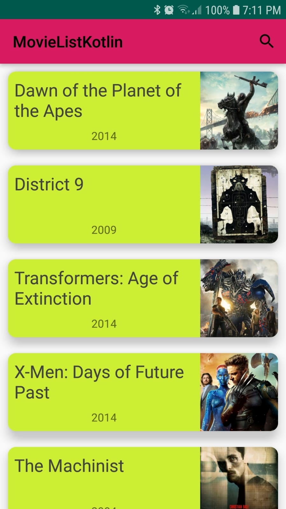
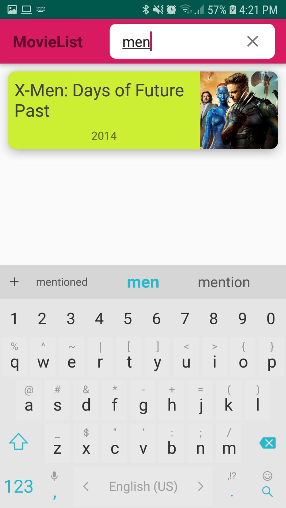
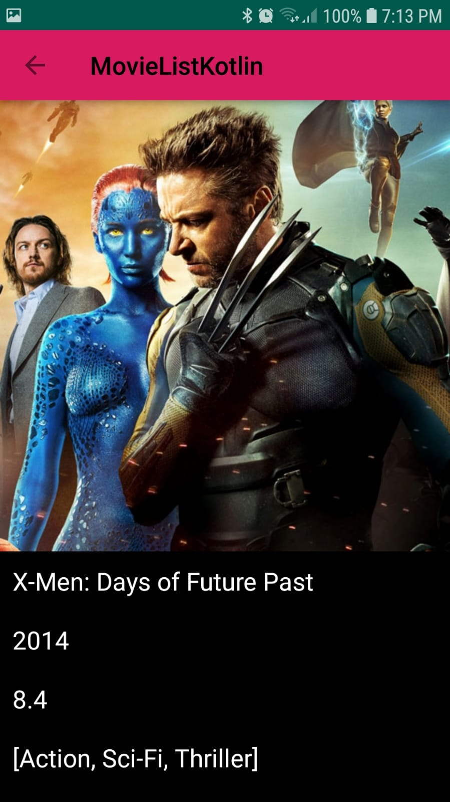

# MovieList

This app is for learning purposes, written in Kotlin, showcases MVVM architecture and Displays simple and powerful RX usage.

- Parsing JSON data fetched using Retrofit http client (https://api.androidhive.info/json/movies.json).
- MVVM architecture in conjunction with RX (RXjava RXandroid).
- Room database as single source of truth, Observing RX streams.
- Querying database for movies ordered by releaseYear.
- Repository pattern, holding and managing the network and database calls, considering internet connectivity.
- SearchView for filtering results by title.
- Converters class for saving objects and lists into Room DB.

 

 

# Flow
Room database in observed so that our movie list is refreshed whenever DB is updated.

We are always interested in fresh network data and update our DB when retrieved, so when the network is down we fallback to saved DB data.

Navigating from MainActivity to DetailActivity can also manage without network because image is auto-cached by Glide.

# ENJOY :)